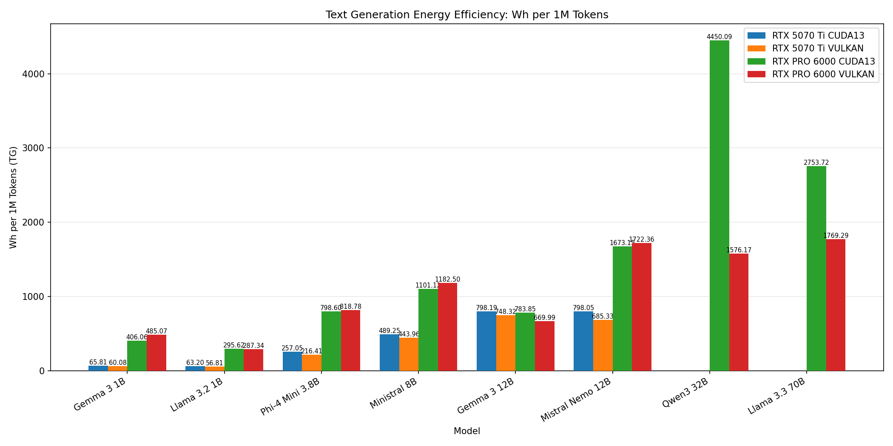
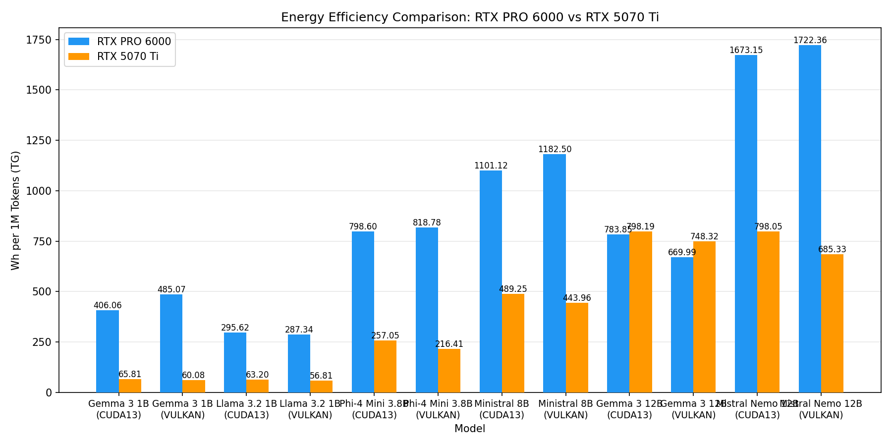
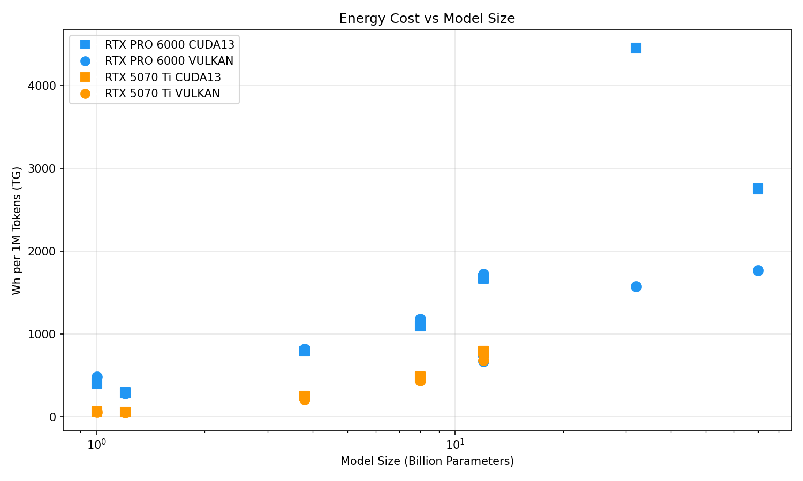

# Power-per-Token Analysis

## Methodology

Energy efficiency is calculated by combining two data sources:

1. **Power readings**: nvidia-smi CSV logs at ~200ms intervals recording GPU power draw (W)
2. **Benchmark results**: llama-bench JSON output with tokens processed and throughput (tokens/sec)

### Energy Calculation

- Power readings are integrated over time using trapezoidal rule to get total energy (Joules)
- Average power (W) during the benchmark run is computed
- Energy per million tokens: `avg_power_W × (1/tokens_per_sec) × 1,000,000 / 3600` = Wh/MT
- This represents the GPU energy cost to generate 1 million tokens

### Data Sources

| Dataset | GPU | Backend | Date | Format | Power Data |
|---------|-----|---------|------|--------|------------|
| PRO 6000 Vulkan | RTX PRO 6000 (96GB) | Vulkan | Feb 9, 2026 | localscore-bench | ✅ |
| PRO 6000 CUDA | RTX PRO 6000 (96GB) | CUDA | Feb 11, 2026 | raw llama-bench | ❌ (no CSV) |
| 5070 Ti Vulkan | RTX 5070 Ti (16GB) | Vulkan | Feb 12, 2026 | localscore-bench | ✅ |
| 5070 Ti CUDA | RTX 5070 Ti (16GB) | CUDA | Feb 12, 2026 | localscore-bench | ✅ |

> ⚠️ **Note**: The Feb 9 PRO 6000 data for small models (1B, 3.8B) was collected while the GPU
> was in a degraded/thermally throttled state. These efficiency numbers may not represent
> optimal PRO 6000 performance for small models.

## Results: Energy Efficiency (Wh per 1M Tokens)

### Text Generation (TG)

| GPU | Backend | Model | Size | TG t/s | Avg Power (W) | Max Temp (°C) | TG Wh/MT | Note |
|-----|---------|-------|------|--------|---------------|---------------|----------|------|
| RTX 5070 Ti | CUDA13 | Gemma 3 1B | 1.0B | 425.9 | 100.9 | 55 | **65.806** |  |
| RTX 5070 Ti | CUDA13 | Llama 3.2 1B | 1.2B | 607.8 | 138.3 | 61 | **63.197** |  |
| RTX 5070 Ti | CUDA13 | Phi-4 Mini 3.8B | 3.8B | 228.2 | 211.2 | 64 | **257.052** |  |
| RTX 5070 Ti | CUDA13 | Ministral 8B | 8.0B | 134.1 | 236.1 | 66 | **489.255** |  |
| RTX 5070 Ti | CUDA13 | Gemma 3 12B | 12.0B | 84.1 | 241.7 | 66 | **798.189** |  |
| RTX 5070 Ti | CUDA13 | Mistral Nemo 12B | 12.0B | 84.4 | 242.5 | 67 | **798.054** |  |
| RTX 5070 Ti | VULKAN | Gemma 3 1B | 1.0B | 362.2 | 78.3 | 48 | **60.085** |  |
| RTX 5070 Ti | VULKAN | Llama 3.2 1B | 1.2B | 601.9 | 123.1 | 53 | **56.814** |  |
| RTX 5070 Ti | VULKAN | Phi-4 Mini 3.8B | 3.8B | 225.0 | 175.3 | 56 | **216.414** |  |
| RTX 5070 Ti | VULKAN | Ministral 8B | 8.0B | 136.2 | 217.7 | 61 | **443.964** |  |
| RTX 5070 Ti | VULKAN | Gemma 3 12B | 12.0B | 81.3 | 219.1 | 63 | **748.316** |  |
| RTX 5070 Ti | VULKAN | Mistral Nemo 12B | 12.0B | 91.3 | 225.4 | 65 | **685.331** |  |
| RTX PRO 6000 | CUDA13 | Gemma 3 1B | 1.0B | 72.7 | 106.3 | 93 | **406.063** | ⚠️ throttled |
| RTX PRO 6000 | CUDA13 | Llama 3.2 1B | 1.2B | 112.2 | 119.5 | 94 | **295.620** | ⚠️ throttled |
| RTX PRO 6000 | CUDA13 | Phi-4 Mini 3.8B | 3.8B | 47.5 | 136.6 | 99 | **798.596** | ⚠️ throttled |
| RTX PRO 6000 | CUDA13 | Ministral 8B | 8.0B | 33.9 | 134.5 | 104 | **1101.120** |  |
| RTX PRO 6000 | CUDA13 | Gemma 3 12B | 12.0B | 112.1 | 316.3 | 86 | **783.852** |  |
| RTX PRO 6000 | CUDA13 | Mistral Nemo 12B | 12.0B | 25.1 | 150.9 | 101 | **1673.152** |  |
| RTX PRO 6000 | CUDA13 | Qwen3 32B | 32.0B | 11.6 | 185.7 | 95 | **4450.092** |  |
| RTX PRO 6000 | CUDA13 | Llama 3.3 70B | 70.0B | 19.7 | 195.4 | 104 | **2753.723** |  |
| RTX PRO 6000 | VULKAN | Gemma 3 1B | 1.0B | 59.8 | 104.5 | 92 | **485.070** | ⚠️ throttled |
| RTX PRO 6000 | VULKAN | Llama 3.2 1B | 1.2B | 112.5 | 116.3 | 93 | **287.337** | ⚠️ throttled |
| RTX PRO 6000 | VULKAN | Phi-4 Mini 3.8B | 3.8B | 43.8 | 129.0 | 98 | **818.779** | ⚠️ throttled |
| RTX PRO 6000 | VULKAN | Ministral 8B | 8.0B | 28.4 | 120.9 | 104 | **1182.497** |  |
| RTX PRO 6000 | VULKAN | Gemma 3 12B | 12.0B | 114.4 | 276.0 | 79 | **669.991** |  |
| RTX PRO 6000 | VULKAN | Mistral Nemo 12B | 12.0B | 22.7 | 141.1 | 95 | **1722.359** |  |
| RTX PRO 6000 | VULKAN | Qwen3 32B | 32.0B | 57.2 | 324.5 | 80 | **1576.174** |  |
| RTX PRO 6000 | VULKAN | Llama 3.3 70B | 70.0B | 29.4 | 187.4 | 104 | **1769.289** |  |

### Prompt Processing (PP)

| GPU | Backend | Model | Size | PP t/s | Avg Power (W) | PP Wh/MT | Note |
|-----|---------|-------|------|--------|---------------|----------|------|
| RTX 5070 Ti | CUDA13 | Gemma 3 1B | 1.0B | 29862.3 | 100.9 | **0.9385** |  |
| RTX 5070 Ti | CUDA13 | Llama 3.2 1B | 1.2B | 23843.0 | 138.3 | **1.6110** |  |
| RTX 5070 Ti | CUDA13 | Phi-4 Mini 3.8B | 3.8B | 10624.2 | 211.2 | **5.5218** |  |
| RTX 5070 Ti | CUDA13 | Ministral 8B | 8.0B | 5901.4 | 236.1 | **11.1156** |  |
| RTX 5070 Ti | CUDA13 | Gemma 3 12B | 12.0B | 4127.0 | 241.7 | **16.2700** |  |
| RTX 5070 Ti | CUDA13 | Mistral Nemo 12B | 12.0B | 4045.7 | 242.5 | **16.6487** |  |
| RTX 5070 Ti | VULKAN | Gemma 3 1B | 1.0B | 31376.1 | 78.3 | **0.6936** |  |
| RTX 5070 Ti | VULKAN | Llama 3.2 1B | 1.2B | 28704.3 | 123.1 | **1.1913** |  |
| RTX 5070 Ti | VULKAN | Phi-4 Mini 3.8B | 3.8B | 10192.2 | 175.3 | **4.7776** |  |
| RTX 5070 Ti | VULKAN | Ministral 8B | 8.0B | 6041.0 | 217.7 | **10.0084** |  |
| RTX 5070 Ti | VULKAN | Gemma 3 12B | 12.0B | 3949.9 | 219.1 | **15.4055** |  |
| RTX 5070 Ti | VULKAN | Mistral Nemo 12B | 12.0B | 3483.7 | 225.4 | **17.9701** |  |
| RTX PRO 6000 | CUDA13 | Gemma 3 1B | 1.0B | 4726.4 | 106.3 | **6.2468** | ⚠️ throttled |
| RTX PRO 6000 | CUDA13 | Llama 3.2 1B | 1.2B | 4657.0 | 119.5 | **7.1251** | ⚠️ throttled |
| RTX PRO 6000 | CUDA13 | Phi-4 Mini 3.8B | 3.8B | 2018.1 | 136.6 | **18.8062** | ⚠️ throttled |
| RTX PRO 6000 | CUDA13 | Ministral 8B | 8.0B | 1086.5 | 134.5 | **34.3952** |  |
| RTX PRO 6000 | CUDA13 | Gemma 3 12B | 12.0B | 8002.8 | 316.3 | **10.9789** |  |
| RTX PRO 6000 | CUDA13 | Mistral Nemo 12B | 12.0B | 768.3 | 150.9 | **54.5562** |  |
| RTX PRO 6000 | CUDA13 | Qwen3 32B | 32.0B | 3015.2 | 185.7 | **17.1076** |  |
| RTX PRO 6000 | CUDA13 | Llama 3.3 70B | 70.0B | 1614.6 | 195.4 | **33.6082** |  |
| RTX PRO 6000 | VULKAN | Gemma 3 1B | 1.0B | 4901.1 | 104.5 | **5.9222** | ⚠️ throttled |
| RTX PRO 6000 | VULKAN | Llama 3.2 1B | 1.2B | 5016.5 | 116.3 | **6.4416** | ⚠️ throttled |
| RTX PRO 6000 | VULKAN | Phi-4 Mini 3.8B | 3.8B | 1864.0 | 129.0 | **19.2230** | ⚠️ throttled |
| RTX PRO 6000 | VULKAN | Ministral 8B | 8.0B | 915.5 | 120.9 | **36.6912** |  |
| RTX PRO 6000 | VULKAN | Gemma 3 12B | 12.0B | 7644.8 | 276.0 | **10.0277** |  |
| RTX PRO 6000 | VULKAN | Mistral Nemo 12B | 12.0B | 7256.1 | 141.1 | **5.3997** |  |
| RTX PRO 6000 | VULKAN | Qwen3 32B | 32.0B | 2754.9 | 324.5 | **32.7222** |  |
| RTX PRO 6000 | VULKAN | Llama 3.3 70B | 70.0B | 1393.9 | 187.4 | **37.3436** |  |

### Performance Only (No Power Data)

| GPU | Backend | Model | Size | PP t/s | TG t/s |
|-----|---------|-------|------|--------|--------|
| RTX PRO 6000 | CUDA13 | Gemma 3 1B | 1.0B | 47925.4 | 463.1 |
| RTX PRO 6000 | CUDA13 | Llama 3.2 1B | 1.2B | 49328.9 | 835.9 |
| RTX PRO 6000 | CUDA13 | Phi-4 Mini 3.8B | 3.8B | 19916.5 | 330.8 |
| RTX PRO 6000 | CUDA13 | Ministral 8B | 8.0B | 10692.0 | 212.1 |
| RTX PRO 6000 | CUDA13 | Gemma 3 12B | 12.0B | 7667.5 | 121.0 |
| RTX PRO 6000 | CUDA13 | Mistral Nemo 12B | 12.0B | 8003.5 | 143.3 |
| RTX PRO 6000 | CUDA13 | Qwen3 32B | 32.0B | 2865.1 | 59.4 |
| RTX PRO 6000 | CUDA13 | Llama 3.3 70B | 70.0B | 1125.1 | 15.0 |

## Charts

### TG Energy Efficiency Across All Configurations

### PRO 6000 vs 5070 Ti Comparison

### Energy Cost vs Model Size

## Key Findings

1. **5070 Ti most efficient model**: Llama 3.2 1B (VULKAN) at 56.814 Wh/MT
2. **5070 Ti least efficient model**: Gemma 3 12B (CUDA13) at 798.189 Wh/MT
3. **PRO 6000 most efficient model**: Llama 3.2 1B (VULKAN) at 287.337 Wh/MT

### GPU Comparison (Same Models)

- **Gemma 3 1B (CUDA13)**: PRO 6000 406.063 vs 5070 Ti 65.806 Wh/MT → **5070 Ti** more efficient (6.17x ratio)
- **Gemma 3 1B (VULKAN)**: PRO 6000 485.070 vs 5070 Ti 60.085 Wh/MT → **5070 Ti** more efficient (8.07x ratio)
- **Llama 3.2 1B (CUDA13)**: PRO 6000 295.620 vs 5070 Ti 63.197 Wh/MT → **5070 Ti** more efficient (4.68x ratio)
- **Llama 3.2 1B (VULKAN)**: PRO 6000 287.337 vs 5070 Ti 56.814 Wh/MT → **5070 Ti** more efficient (5.06x ratio)
- **Phi-4 Mini 3.8B (CUDA13)**: PRO 6000 798.596 vs 5070 Ti 257.052 Wh/MT → **5070 Ti** more efficient (3.11x ratio)
- **Phi-4 Mini 3.8B (VULKAN)**: PRO 6000 818.779 vs 5070 Ti 216.414 Wh/MT → **5070 Ti** more efficient (3.78x ratio)
- **Ministral 8B (CUDA13)**: PRO 6000 1101.120 vs 5070 Ti 489.255 Wh/MT → **5070 Ti** more efficient (2.25x ratio)
- **Ministral 8B (VULKAN)**: PRO 6000 1182.497 vs 5070 Ti 443.964 Wh/MT → **5070 Ti** more efficient (2.66x ratio)
- **Gemma 3 12B (CUDA13)**: PRO 6000 783.852 vs 5070 Ti 798.189 Wh/MT → **PRO 6000** more efficient (0.98x ratio)
- **Gemma 3 12B (VULKAN)**: PRO 6000 669.991 vs 5070 Ti 748.316 Wh/MT → **PRO 6000** more efficient (0.90x ratio)
- **Mistral Nemo 12B (CUDA13)**: PRO 6000 1673.152 vs 5070 Ti 798.054 Wh/MT → **5070 Ti** more efficient (2.10x ratio)
- **Mistral Nemo 12B (VULKAN)**: PRO 6000 1722.359 vs 5070 Ti 685.331 Wh/MT → **5070 Ti** more efficient (2.51x ratio)

### Thermal Throttling Impact

The Feb 9 PRO 6000 data was collected during a period of thermal throttling, particularly
affecting small model benchmarks. The GPU was running at reduced clocks (~420 MHz SM)
with temperatures at 90°C. This degrades both throughput and energy efficiency since the
GPU still draws significant idle/base power while producing fewer tokens per second.

### CUDA vs Vulkan on 5070 Ti

- **Gemma 3 1B**: CUDA 65.806 vs Vulkan 60.085 Wh/MT → **Vulkan** more efficient
- **Llama 3.2 1B**: CUDA 63.197 vs Vulkan 56.814 Wh/MT → **Vulkan** more efficient
- **Phi-4 Mini 3.8B**: CUDA 257.052 vs Vulkan 216.414 Wh/MT → **Vulkan** more efficient
- **Ministral 8B**: CUDA 489.255 vs Vulkan 443.964 Wh/MT → **Vulkan** more efficient
- **Gemma 3 12B**: CUDA 798.189 vs Vulkan 748.316 Wh/MT → **Vulkan** more efficient
- **Mistral Nemo 12B**: CUDA 798.054 vs Vulkan 685.331 Wh/MT → **Vulkan** more efficient

---
*Generated by `tools/power_per_token.py`*
